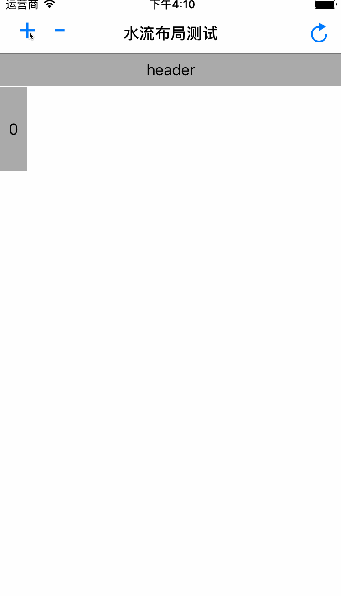
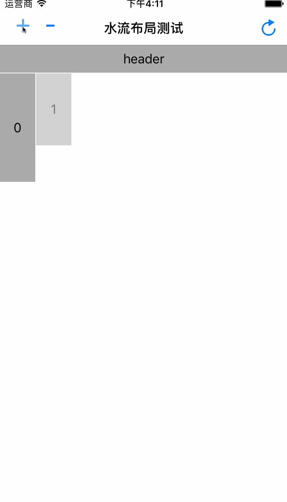
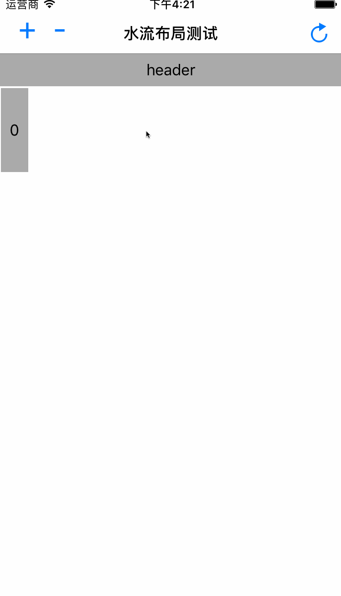

# WYWaterFlowLayout 像河流一样的布局
####做项目的时候遇到一些界面需要的布局非常自由而网上搜了一些开源的代码都没找到一个理想的，于是自己就准备写一种比较理想的布局，一种可以像系统的UICollectionViewFlowLayout一样从左到右的流式布局，又能像CHTCollectionViewWaterfallLayout一样的从上到下瀑布流布局，想到就做(就算不能一步到位也可以慢慢实现直到解决问题)。
这里首先来看一下UICollectionViewFlowLayout的一种布局情况    
    
可以看到这么多空白位置多浪费啊，这也是我想写一个布局的原因之一(浪费可耻啊)

然后在看一个网上写的比较好的布局CHTCollectionViewWaterfallLayout显示情况    
    
虽然不浪费空间了，但是有一个致命的问题(宽度都是一样的)，对于一个追求完美的程序员来所这完全是无法容忍的(作者不要打我。我这里只是说不够理想，并不是说这个布局不够好，这个布局是我在GitHub上见过写得最好的了)...    
    
下面看一个理想中的布局    
    
为了这个理想布局我开始了撸代码。    

这里首先打下草稿定下几点实现思路    
1.布局方向采用从上到下从左到右(就类似下的雨留到河流里面的继续往海里流一样)    
2.所有复杂页面的布局都能通过业务层给出适当的size实现    
3.理想状态是性能要高    
    
在我撸啊撸的情况下总算撸出来了一个[初版](初版.zip)。为什么叫初版呢? 是因为虽然功能是实现了，但是细节和性能还有待提升！这需要后续持续完善    
    
下面给出初版的性能测试对比（测试设备:iPhone6，数据量:10万）    
function                              |   preparLayout(ms)  |   layoutInRect(ms)    |    内存使用(1条数据的时候4.9MB)
UICollectionViewFlowLayout            |   258.518           |   1.100               |    20.9MB
CHTCollectionViewWaterfallLayout      |   864.026           |   1.613               |    35.6MB
WYWaterFlowLayout                     |   1645.468          |   1.616               |    51.6MB

当然10万数据有点大  这里给个1万数据的测试
function                              |   preparLayout(ms)  |   layoutInRect(ms)    |    内存使用             
UICollectionViewFlowLayout            |   25.087            |   0.614               |    6.7MB
CHTCollectionViewWaterfallLayout      |   80.257            |   0.271               |    8.8MB
WYWaterFlowLayout                     |   160.849           |   0.209               |    10.3MB

看这个测试数据勉强还能接受，除了布局时间长一点，滑动性能还可以(基本算可以使用了)。    
但是对于一个励志要改变世界的程序员来说必须得追求极限，这里跟CHTCollectionViewWaterfallLayout对比性能相差了将近一倍,性能瓶颈主要在下面这个函数    
---
- (CGRect)willAddItemWithSize:(CGSize)size maxWidth:(CGFloat)maxWidth maxTop:(CGFloat *)p_top withSpaces:(NSMutableArray<WYSpaceIndexSet *> *)emptySpaces
---
这个函数主要是传入一个需要布局的item的size、布局所在的宽度和空白位置记录数据，返回这个item的frame和当前布局到的最大y坐标    
函数主要是做了三件事    
1.根据已有空位记录找到要插入的item可以放的位置    
2.更新空白位置记录，比插入item低的空位被它占用，比插入item高的会占用当前的空位    
3.把空位记录按低到高左到右排序    
   
